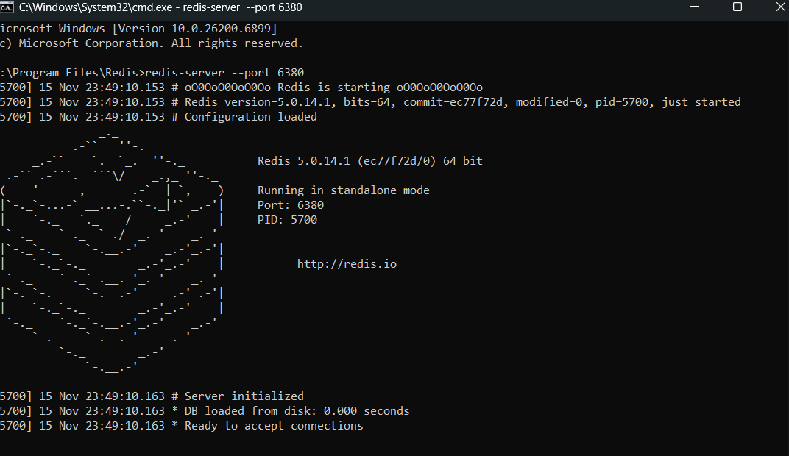
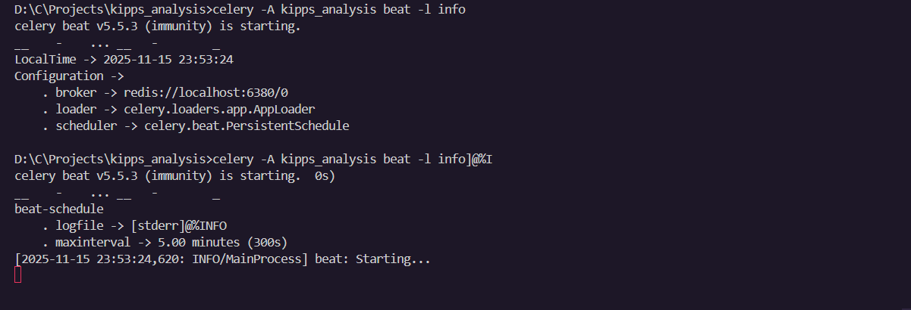
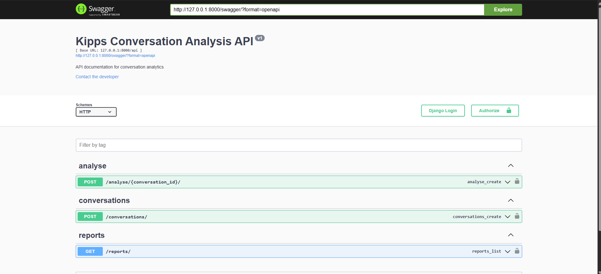
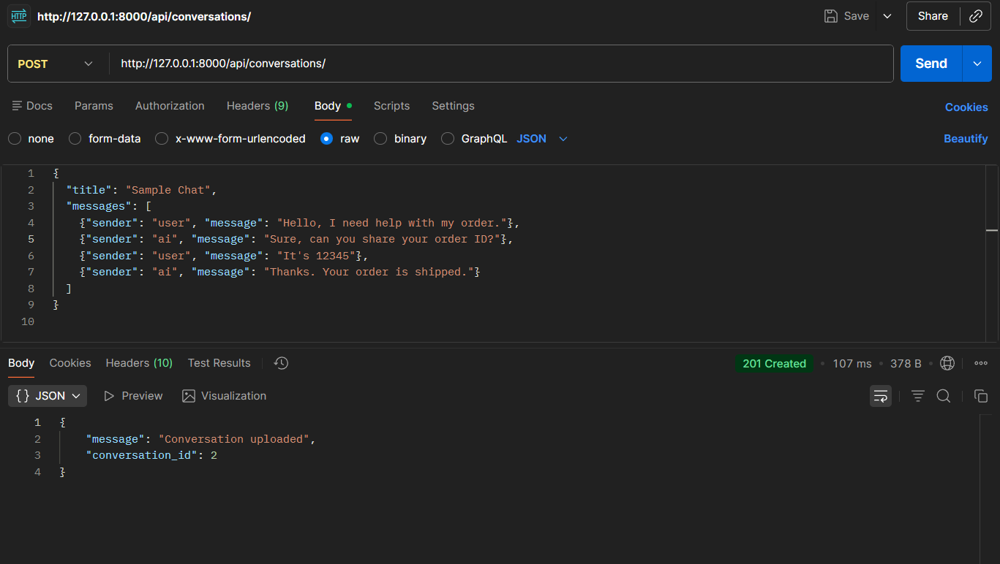
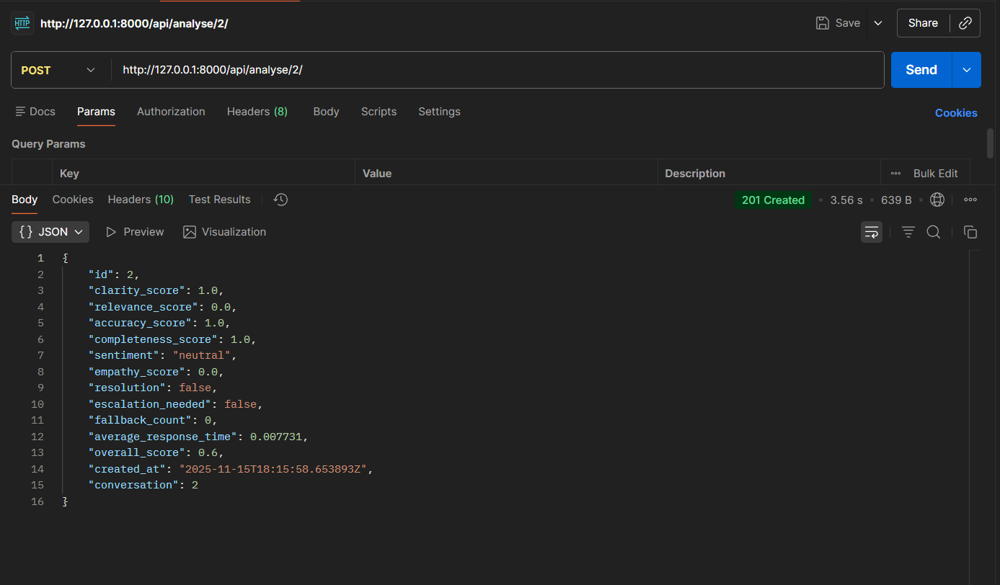
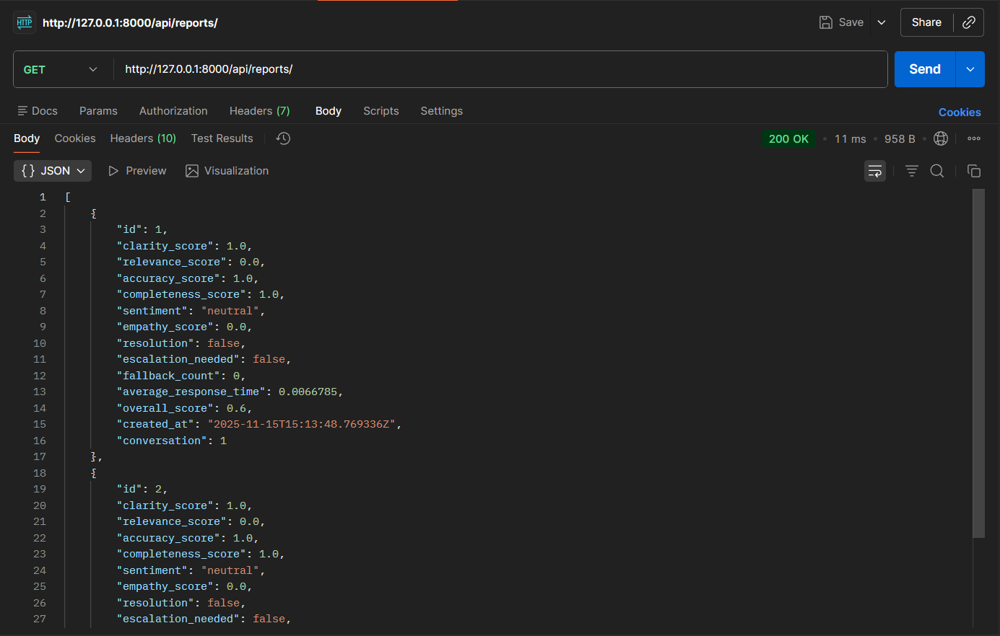

---

# 📘 **AI Conversation Analysis System**

This project is a **Django + DRF-based AI Conversation Analysis System** developed as part of a **technical assessment**.
It allows uploading chat conversations, analyzing them using custom logic, and generating daily automated analysis reports using **Celery Beat**.

The system evaluates conversations across multiple quality metrics such as **clarity**, **relevance**, **accuracy**, **sentiment**, **empathy**, **fallback**, **resolution**, and more.


---

# 🚀 **Features**

### 📝 Upload Conversations

Send chat messages (user + AI) to the system.

### 🤖 Automated Conversation Analysis

Generates multiple metrics:

* Clarity
* Relevance
* Accuracy
* Completeness
* Sentiment
* Empathy
* Fallback Count
* Resolution
* Response Time
* Overall Score

### 📊 View All Analysis Reports

REST endpoint for all stored analysis records.

### ⏱ Daily Scheduled Auto-Analysis

Celery Beat automatically processes un-analysed conversations.

### 📘 Live API Documentation

Swagger UI for easy API testing.

---

# 🛠 **Tech Stack**

| Component  | Technology             |
| ---------- | ---------------------- |
| Backend    | Django 5, DRF          |
| NLP        | TextBlob, NLTK WordNet |
| Task Queue | Celery                 |
| Scheduler  | Celery Beat            |
| Broker     | Redis                  |
| Database   | SQLite                 |
| API Docs   | Swagger (drf-yasg)     |
| Python     | 3.8+                   |

---

# 📂 **Project Structure**

```
kipps_analysis/
│
├── kipps_analysis/
│   ├── settings.py
│   ├── celery.py
│   ├── urls.py
│   └── wsgi.py
│
├── conversations/
│   ├── models.py
│   ├── serializers.py
│   ├── views.py
│   ├── analysis_logic.py
│   ├── tasks.py
│   ├── urls.py
│   └── admin.py
│
├── requirements.txt
└── README.md
```

---

# 📦 **Installation & Setup**

### Prerequisites

- Python 3.8 or higher
- Redis server installed and running
- pip (Python package manager)

### 1️⃣ Clone Repository

```bash
git clone <your-repo-url>
cd kipps_analysis
```

### 2️⃣ Create Virtual Environment (Recommended)

```bash
python -m venv venv

# On Windows:
venv\Scripts\activate

# On Linux/Mac:
source venv/bin/activate
```

### 3️⃣ Install Dependencies

```bash
pip install -r requirements.txt
```

### 4️⃣ Download NLTK Data

The analysis logic requires NLTK's WordNet corpus. Download it using:

```python
python -c "import nltk; nltk.download('wordnet')"
```

Alternatively, you can download it interactively:

```python
import nltk
nltk.download('wordnet')
```

### 5️⃣ Run Database Migrations

```bash
python manage.py migrate
```

---

# 🔄 **Background Services (Redis, Celery Worker & Celery Beat)**

For scheduled analysis, three services must run simultaneously:

### **1️⃣ Redis Server (Message Broker)**

Used by Celery for sending tasks.

```bash
redis-server
```

📸 *Screenshot:*


---

### **2️⃣ Celery Worker (Executes Background Jobs)**

Processes analysis logic in the background.

```bash
celery -A kipps_analysis worker --pool=solo -l info
```

📸 *Screenshot:*


---

### **3️⃣ Celery Beat (Task Scheduler)**

Triggers the `daily_analyse` task every day.

```bash
celery -A kipps_analysis beat -l info
```

📸 *Screenshot:*


---

# ▶️ **Run Django Server**

```bash
python manage.py runserver
```

---

# 📘 **Swagger API Documentation**

Available at:

👉 **[http://127.0.0.1:8000/swagger/](http://127.0.0.1:8000/swagger/)**

📸 *Screenshot:*


---

# 📡 **API Endpoints**

| Endpoint              | Method | Description                            |
| --------------------- | ------ | -------------------------------------- |
| `/api/conversations/` | POST   | Upload a conversation                  |
| `/api/analyse/<id>/`  | POST   | Analyse a specific conversation        |
| `/api/reports/`       | GET    | List all conversation analysis reports |

---

# 🧪 **API Testing (Postman)**

### **1️⃣ Upload Conversation**



### **2️⃣ Analyse Conversation**



### **3️⃣ View Reports**



---

# 🧠 **Analysis Logic Explained**

### ✔ Clarity

Checks if AI responses are understandable, not too short or overly long.

### ✔ Relevance

Uses NLTK WordNet semantic similarity to match user intent with AI response.

### ✔ Accuracy

Decreases score if AI uses uncertain phrases like “maybe”, “not sure”.

### ✔ Completeness

Ensures every user message receives an AI reply.

### ✔ Sentiment

TextBlob polarity for user emotion detection.

### ✔ Empathy

Counts empathetic phrases like:
“Sorry”, “I understand”, “I can help”, “No worries”.

### ✔ Fallback Count

Detects fallback responses like:
“I don’t know”, “I cannot help”.

### ✔ Resolution

Checks if conversation ended positively ("thanks", "solved", etc.).

### ✔ Response Time

Measures time gap between user → AI messages.

### ✔ Overall Score

```
(clarity + relevance + accuracy + completeness + empathy) / 5
```

---

# ⏱ **Daily Auto Analysis (Celery Beat)**

Every day, a scheduled task runs:

```python
@shared_task
def daily_analyse():
    conversations = Conversation.objects.filter(analysis__isnull=True)
    ...
```

Celery worker output example:

📸 *Screenshot:*
``

---

# 🧾 **Example Analysis Output**

```json
{
    "clarity_score": 1.0,
    "relevance_score": 0.43,
    "accuracy_score": 1.0,
    "completeness_score": 1.0,
    "sentiment": "positive",
    "empathy_score": 0.5,
    "resolution": true,
    "fallback_count": 0,
    "escalation_needed": false,
    "average_response_time": 0.21,
    "overall_score": 0.78
}
```

---

# 🏁 **Conclusion**

This project successfully implements all required features of a complete **AI-based conversation analysis backend**, including:

* Conversation upload API
* Multi-metric conversation analysis
* Persistent storage of reports
* Automated daily background processing
* Redis + Celery Worker + Celery Beat integration
* Swagger API documentation
* Fully tested with Postman

The architecture follows clean backend development practices and can be easily extended with more advanced NLP models or additional scoring features in the future.

---